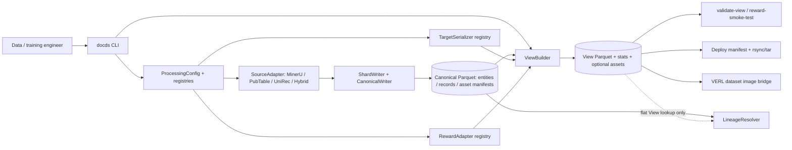
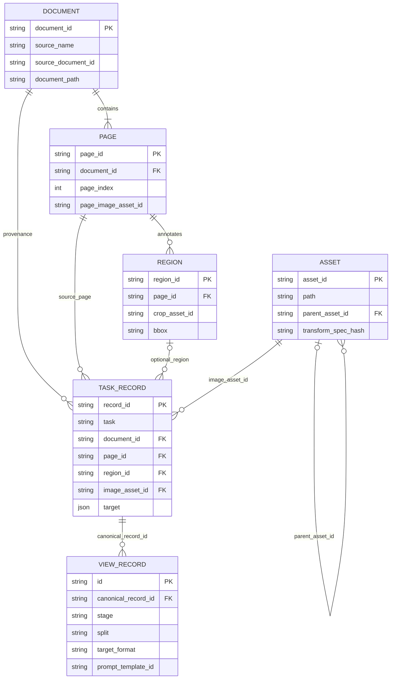
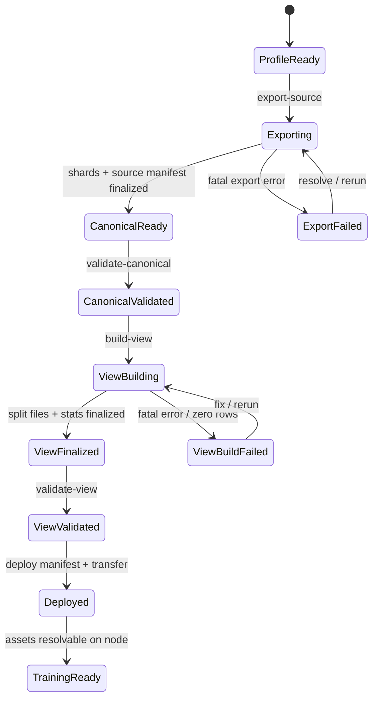

# Dataset Management Module — Story and UML Design

> **Document type:** Implementation-grounded Story / architecture narrative  
> **Baseline:** `master` at [`2625b821`](https://github.com/linglongOCR-group/OCR-VLM-Training/commit/2625b821a129cfcbd3f3ce3fa0fd125bf0e7e0f1) (2026-06-04)  
> **Reviewed:** 2026-10-10  
> **Status:** Descriptive companion document, **not** a replacement for `openspec/specs/`  
> **Scope:** `tools/data_management/`, `configs/data/`, `scripts/data/`, related runtime integration and tests

## 1. Story: why this module exists

**As an OCR/VLM dataset and training engineer,** I need to transform heterogeneous source annotations into a reusable, model-independent representation and reproducible, model-specific SFT/RLVR datasets, **so that** I can change data mixtures, prompts, serializers, image policies, and reward profiles without repeatedly re-parsing raw datasets or losing the path back to source evidence.

The organizing principle is **Source → Canonical → View**:

- **Source** preserves raw images/PDFs and annotations; ingestion reads but should not mutate them.
- **Canonical** represents documents, pages, regions, task targets, assets, and source provenance independently of a particular model/training stage.
- **View** materializes training records with task selection, sampling, splits, prompts, labels, image carriers, and (for RLVR) reward payloads.
- **Runtime / audit** loads View data into VERL, validates data quality, scores predictions, traces available lineage, and deploys view data/assets to nodes.

The implemented module prioritizes **registry + source adapters + declarative profiles + Parquet shards**, with different implementation maturity across lifecycle stages. This story distinguishes **`[Implemented]`**, **`[Partial]`**, and **`[Planned/spec-only]`**. Mermaid diagrams describe **as-is design** unless labeled conceptual.

### 1.1 Actors and outcomes

| Actor | Job to be done | Evidence / exit artifact |
| --- | --- | --- |
| Data engineer | Onboard a MinerU, PubTable, UniRec, or Hybrid Message source | Source profile, canonical partitions, source manifest |
| Dataset curator | Reuse canonical records to choose tasks, source mixes, filters and splits | View YAML, materialized SFT/RLVR Parquet, `stats.json` |
| Training engineer | Consume images/prompts with VERL and transfer required files to training nodes | Validated View and deploy manifest |
| RL engineer | Supply verifiable reference labels and score predictions | RLVR reward profile/payload, reward smoke-test results |
| Dataset auditor | Investigate bad rows, missing assets, leakage and source origin | Validation output, record IDs, current lineage resolver result |

### 1.2 Boundaries

**In scope:** built-in source adapters, config/registries, canonical entities, asset records, view building, target serializers, Normalized Levenshtein reward, CLI, validation, limited trace, view deployment, and the VERL image-column bridge.

**Not implemented as general guarantees:** comprehensive source format coverage promised by historical specs; generalized AssetManager; complete referential-integrity and provenance traversal; sidecar reward-payload production; TEDS/CDM/IoU/graph reward implementations; training orchestration itself. VERL owns trainer, distributed execution, rollout, and checkpoint logic.

## 2. Evolution: decisions observed in history

| Milestone | Evidence | Architectural consequence |
| --- | --- | --- |
| 2026-04-28 initial module | [`31b65bf1`](https://github.com/linglongOCR-group/OCR-VLM-Training/commit/31b65bf1e78591e837e4615bb578ebe1023643f7) | Core adapters, data contracts, CLI and processing design enter the repo |
| 2026-04-30 portable images / parallel views | [`34a04146`](https://github.com/linglongOCR-group/OCR-VLM-Training/commit/34a041469e481b6a93f59b2764ca0d7d38fe7067), [`62fd780f`](https://github.com/linglongOCR-group/OCR-VLM-Training/commit/62fd780f14cadae768f707523bde2f7991a4f1b7) | Explicit embedded/path image carriers; parallel materialization |
| 2026-05-09–19 adapter growth | [`0ec9eef9`](https://github.com/linglongOCR-group/OCR-VLM-Training/commit/0ec9eef94c418f8db790d8baa1c0e323ebdd006c) | Hybrid Message and PubTable handling, label filtering, efficient manifest reads |
| 2026-05-29 clean-up and spec migration | [`d66badd9`](https://github.com/linglongOCR-group/OCR-VLM-Training/commit/d66badd916eb7d8d2d209af41ba12afc16eb94a0), [`cb0fbdae`](https://github.com/linglongOCR-group/OCR-VLM-Training/commit/cb0fbdae5bd1f08c5ec001e9b46050e03378f1be) | Shared adapter helpers, lazy lineage index, OpenSpec as the current specification location |
| 2026-05-30 consolidation | [PR #2](https://github.com/linglongOCR-group/OCR-VLM-Training/pull/2) / [`e2ccc7cf`](https://github.com/linglongOCR-group/OCR-VLM-Training/commit/e2ccc7cf1024e6301b44ebda67201c83d4292ee3) | UniRec40M, model-compatible View configurations, view deploy utility |
| 2026-06-04 integration | [PR #1](https://github.com/linglongOCR-group/OCR-VLM-Training/pull/1) | Dataset module integrated into `master` |
| 2026-06-04 materialization resilience | [PR #4](https://github.com/linglongOCR-group/OCR-VLM-Training/pull/4) / [`57757a60`](https://github.com/linglongOCR-group/OCR-VLM-Training/commit/57757a602858962e29107aa29184651ffb2a6c86) | Opt-in per-record `--skip-failure` and structured failures in `stats.json` |

**Documentation precedence:** use `openspec/specs/` for maintained requirements; `openspec/changes/` for proposed/delta requirements; `docs/archive/dataset-data-spec.md` and `docs/archive/dataset-process-module-spec.md` for historical design intent. Where requirements conflict with executable behavior, this story names the difference rather than silently asserting compliance.

## 3. System context and responsibilities



| Component | Concrete implementation | Responsibility |
| --- | --- | --- |
| Config/registry | `config/resolver.py`, `registry/{base,configured}.py`, `configs/data/processing.yaml` | Resolve `OCR_DATA_ROOT`; import adapter/serializer/reward classes by declared names |
| Source export | `sources/adapters/{mineru,pubtable,unirec,hybrid_message}.py` | Parse heterogeneous records, assign stable IDs, generate canonical entities/task records/assets |
| Canonical persistence | `sources/adapters/_shared.py`, `canonical/{writer,reader}.py` | Write source/task Parquet shards; read tasks and asset manifests; write per-source JSON manifest |
| View construction | `views/builder.py` | Select, sample, filter, split, serialize, resolve images, prepare RLVR payload, materialize split Parquet |
| Integrity checks | `canonical/validator.py`, `views/validator.py` | Check currently implemented record/schema/split/image constraints |
| Rewards | `rewards/levenshtein.py`, `views/reward_tools.py` | Prepare inline Normalized Levenshtein reference and score predictions |
| Runtime | `runtime/image_columns.py`, `runtime/verl_multimodal_dataset.py` | Convert View image carrier into VERL-compatible images and messages |
| Deployment | `deploy.py`, `scripts/data/deploy_view_to_nodes` | Build a dataset-relative transfer manifest and perform rsync/tar distribution |
| Lineage | `lineage/resolver.py` | Resolve a canonical record by ID; resolve **flat** root-level view records back to canonical records |

### 3.1 UML class diagram (implemented interfaces, intentionally simplified)

```mermaid
classDiagram
    class SourceAdapter {
      <<abstract>>
      +name
      +version
      +export(canonical_root, tasks, overwrite_partitions, progress)
    }
    class MinerUSourceAdapter
    class PubTableSourceAdapter
    class UniRecSourceAdapter
    class HybridMessageSourceAdapter
    SourceAdapter <|-- MinerUSourceAdapter
    SourceAdapter <|-- PubTableSourceAdapter
    SourceAdapter <|-- UniRecSourceAdapter
    SourceAdapter <|-- HybridMessageSourceAdapter

    class ShardWriter {
      +write_many(rows)
      +flush()
      +close()
    }
    class CanonicalWriter {
      +write_manifest(source_name, manifest)
      +write_task_records(task, source_name, records)
    }
    class CanonicalReader {
      +read_task_records(task, source_name)
      +read_asset_manifest(asset_ids, source_names)
    }
    class ViewBuilder {
      +from_config_path(config_path)
      +build(view_config, overwrite, skip_failure)
      -_load_selected_records(config)
      -_assign_splits(records, policy)
      -_materialize(record, config, context)
    }
    class TargetSerializer {
      <<abstract>>
      +serialize(canonical_record, context)
      +validate(canonical_record)
    }
    class RewardAdapter {
      <<abstract>>
      +prepare_payload(canonical_record, view_record, config)
      +score(prediction, payload, context)
    }
    class SplitParquetWriter {
      +write(row)
      +finish()
      +abort()
    }
    class LineageResolver {
      +trace_view_record(view_record_id)
      +trace_canonical_record(canonical_record_id)
    }
    SourceAdapter ..> ShardWriter : exports
    SourceAdapter ..> CanonicalWriter : source manifest
    ViewBuilder --> CanonicalReader : reads
    ViewBuilder ..> TargetSerializer : serializes
    ViewBuilder ..> RewardAdapter : RLVR only
    ViewBuilder *-- SplitParquetWriter : output
    LineageResolver ..> CanonicalReader : conceptual store access
```



**Important:** `SourceAdapter` currently declares only the abstract `export()` method. The five-method scan/export abstraction in the maintained ingestion specification is **not** the implemented base-class contract. Also, the final class-diagram link from `LineageResolver` to `CanonicalReader` is **logical data-store coupling**, not a direct Python call: the resolver reads Parquet using pandas/pyarrow.

## 4. Dataset entities, materialization, and invariants

### 4.1 UML data relationship diagram (logical IDs, not enforced foreign keys)



`CanonicalTaskRecord.target` is structured and model-independent; `ViewRecord.label` is serialized model output. For layout, canonical bounding boxes use `canonical_page_pixel_xyxy` and the MinerU serializer produces the normalized 0–1000 token grid after applying the configured image transform. Task records point to a page image for layout or to a region crop for recognition as produced by the concrete adapter.

Current disk contract (source and view names below are placeholders):

```text
$OCR_DATA_ROOT/
  sources/<source-name>/...                         # raw, preserve
  canonical/
    entities/documents/source=<source-name>/part-*.parquet
    entities/pages/source=<source-name>/part-*.parquet
    entities/regions/source=<source-name>/part-*.parquet
    records/<task>/source=<source-name>/part-*.parquet
    assets/manifests/source=<source-name>/part-*.parquet
    assets/files/source=<source-name>/...           # if derivatives are copied/cropped
    manifests/sources/<source-name>.json
  views/<view-name>/
    view.yaml
    stats.json
    train.parquet | train/part-*.parquet
    val.parquet   | val/part-*.parquet
    test.parquet  | test/part-*.parquet
    assets/...                                      # optional transformed references
```

**Physical versus logical guarantees:** The canonical schema includes IDs and provenance but `validate-canonical` currently checks a limited set of columns and record-ID duplication **between scanned files**. It does not perform complete document/page/region/asset foreign-key validation. Source manifests are **JSON**, despite the `.yaml` name appearing in one architecture requirement.

### 4.2 View record contract and image carriers

| Mode | Populated field | Image acquisition | Portability consequence |
| --- | --- | --- | --- |
| `embedded` | `images_bytes` | Image bytes in Parquet, optionally transformed | Standalone rows but larger shards |
| `source_reference` | `images_path` | Dataset-root-relative image paths; transformed images saved in View assets | Requires source/canonical/view files at destination |
| `nested_reference` | `images`, e.g. `[{"image": "canonical/..."}]` | VERL-style nested dictionaries of dataset-root-relative paths | Requires reachable assets; avoids embedding bytes |

`image_path` remains a debugging/lineage field; the runtime uses the carrier. `resolve_runtime_images` prioritizes embedded bytes, then `images_path`, then nested `images`. Relative paths are validated against absolute paths/traversal. Referenced images must exist at runtime. `ViewBuilder` computes a `view_image_asset_id`, but a full persisted view-asset lineage manifest is not yet implemented.

### 4.3 Story rules and derived invariants

- Each View belongs to one `stage` (`sft`, `rlvr`, or `eval`) and is configured independently.
- `include` reads selected `task/source` partitions; `exclude` and secondary predicates filter rows; `sample` uses a seed-dependent SHA-256 key ordering for record/page/document subsets.
- `split_policy.level` defaults to `document`. A SHA-256-derived bucket maps each document/page/record key to train/val/test; identical keys receive the same split within a build. Output ratios are statistical, not a guarantee of exact sample counts.
- `target_serialization` is task-specific and uses a named registered serializer; built-ins cover layout, table (OTSL or plain text), formula and text.
- SFT materialization additionally emits `messages`. RLVR materialization adds `reward_profile_id`, inline `reward_payload`, `reward_model`, `answer_key`, and `verifier_metadata`.
- `shard_policy.rows_per_shard` bounds rows per split shard. The View builder selects records into Python lists before writing: **streaming Parquet output does not imply bounded total selection memory**.
- `stats.json` reports actually written split counts, optional filter counts/shard counts and, when present, skipped materialization diagnostics. It is not a substitute for `validate-view`.

## 5. User stories and acceptance criteria

The BDD cases below describe **working, code-grounded paths**, except those specifically tagged `[Partial]`. They are suitable for regression tests and operator acceptance, not a claim that the test suite was run during this documentation review.

### ST-01 — Register and export a heterogeneous source [Implemented]

**As a data engineer**, I want to select a configured source adapter/profile and optional task subset, so that raw annotations can be converted to canonical entities, task records and asset references without rewriting raw input.

- **Given** `OCR_DATA_ROOT`, a source profile, and an adapter registered in `configs/data/processing.yaml`
- **When** I run `docds export-source <adapter> --source-config <profile> --tasks <tasks>`
- **Then** the adapter writes per-source entity and task Parquet partitions, asset-manifest shards and `manifests/sources/<name>.json`
- **And** its output uses stable document/page/region/record/asset IDs where supported by the source mapping
- **And** raw Source content is read, not intentionally rewritten.

Built-in keys: `mineru`, `pubtable`, `unirec`, `hybrid_message`. Implementation detail: adapters use `ShardWriter` and write their own records; they do not all exercise the convenience `CanonicalWriter.write_*` methods.

### ST-02 — Make export failure policy explicit [Implemented, adapter-dependent]

**As a data engineer**, I need to choose between strict exports and best-effort exports so that malformed samples do not silently vanish.

- **Given** a malformed source sample, **when** `--skip-errors` is absent, **then** the export raises a descriptive error (strict default).
- **Given** the same malformed sample, **when** `--skip-errors` is enabled, **then** the adapter omits it, increments skipped counts, and includes a failure entry in the completed source manifest.
- **Given** a MinerU re-export with `--skip-completed`, **when** already-exported source document IDs are present, **then** the MinerU adapter skips them and appends missing samples instead of overwriting that partition.

**Guardrail:** an interrupted or strict-mode failing export can leave partial shard output; do not treat an incomplete run as a validated dataset. `--skip-completed` is **not** a universal SourceAdapter capability.

### ST-03 — Build a deterministic SFT training view [Implemented]

**As a dataset curator**, I want to select sources/tasks, filter labels, choose serializers and assign splits without mutating the Canonical layer.

- **Given** valid canonical partitions and a View YAML with `stage: sft`
- **When** `docds build-view <view-config>` runs
- **Then** it resolves includes, excludes, sampling, label and optional image filters; assigns seeded splits; renders a task prompt; and serializes the canonical target to `label`
- **And** every successful row includes `canonical_record_id`, `canonical_image_asset_id`, `source_name`, `target_format` and `prompt_template_id`
- **And** SFT rows include a user/assistant `messages` pair, with split Parquet and `stats.json` written at the configured View root.
- **And** SFT labels containing literal reserved `<image>` or `<video>` text are filtered and counted as `reserved_media_token_label` before materialization.

Built-in serializer behavior is not interchangeable: `enhanced_otsl_v1` requires OTSL/enhanced OTSL/convertible HTML, while `table_text_v1` requires a plain table `text` target.

### ST-04 — Prepare an RLVR view and smoke-test the reward [Implemented within inline Levenshtein scope]

**As an RL engineer**, I need deterministic reference rewards associated with training records rather than hard-coded reward computations in Parquet.

- **Given** `stage: rlvr` and `reward_profile.default: normalized_levenshtein_v1`
- **When** I build the View, **then** each valid row contains a reward profile ID and inline reference-label payload.
- **When** I run `docds reward-smoke-test --view <view-path>` on a **flat** View, **then** it scores its reference label using the registered Normalized Levenshtein adapter and reports count/min/mean/max.
- **When** I run `docds score-predictions` with a matching prediction Parquet, **then** the tool emits score rows.

**Limit:** current reward utilities scan root-level `*.parquet` files only. They do not yet discover `train/part-*.parquet`-style sharded Views. Sidecar reward payloads and task-specific CDM/TEDS rewards are spec-level extension points, not this built-in working path.

### ST-05 — Supply portable multimodal inputs to VERL [Implemented]

**As a training engineer**, I want a consistent image contract across View materialization modes so that I can switch between compact reference views and embedded images.

- **Given** `image_policy.materialization.mode` set to one of `embedded`, `source_reference` or `nested_reference`
- **When** a View row is materialized, **then** it uses that mode's image carrier, not multiple non-empty carriers.
- **When** `validate-view --require-images` runs, **then** the selected carrier has valid structure and reachable references, and prompt image placeholders are consistent with the image count.
- **When** the VERL dataset adapter prepares the row, **then** referenced paths are resolved against the dataset root and embedded bytes are converted to VERL-compatible image objects.
- **And** the SFT bridge protects literal media tokens in non-user text during message parsing.

### ST-06 — Isolate bad rows while keeping View builds auditable [Implemented]

**As a dataset curator**, I want an opt-in failure policy that salvages valid training samples without concealing global build errors.

- **Given** the default build, **when** per-record `_materialize()` fails in schema inference or writing, **then** the build fails fast.
- **Given** `--skip-failure`, **when** a sampled or output record fails inside `_materialize()`, **then** that occurrence is logged with phase, record, source, task, serializer and exception details, and other valid rows can continue.
- **When** all schema samples fail, **then** schema inference raises rather than inventing a schema.
- **When** no output rows survive final materialization, **then** the build raises.
- **And** `stats.json` includes aggregate skip counts (`by_phase`, `by_task`, `by_source`, `by_exception_type`) and at most ten example diagnostic records.

**Counting nuance:** a single logical record may fail once during inference and again during writing. The reported `total` is a count of **failure occurrences**, not guaranteed unique failed record IDs. `--skip-failure` does not bypass config/selection/split/schema-unification errors.

### ST-07 — Validate and investigate provenance [Partial]

**As a dataset auditor**, I need to reject obvious invalid rows and trace a suspect sample to a canonical record.

- **Given** canonical task shards, **when** `validate-canonical` runs, **then** it checks required record columns and detects record IDs repeated across scanned Parquet files.
- **Given** View output, **when** `validate-view` runs, **then** it checks required columns, prompt/label, split-file consistency, RLVR fields, image-carrier rules, aspect ratio, and cross-split document leakage.
- **Given** a canonical record ID, **when** `docds trace --canonical-record-id ...` runs, **then** the resolver lazily indexes canonical Parquet files and retrieves the matching row.
- **Given** a **flat** View root and a View ID, **when** `docds trace --view-record-id ...` runs, **then** the result includes the View row and corresponding Canonical row.

**Not yet satisfied:** end-to-end entity/asset/raw-annotation traversal; sharded View ID lookup; source checksum and referential-integrity validation. The diagram in `4.1 is a logical contract, not a list of enforced database constraints.

### ST-08 — Deploy a View and its referenced images [Implemented]

**As an operations engineer**, I need to transfer exactly the View files and dataset-root-relative image dependencies required on remote training nodes.

- **Given** a finalized View and source dataset root, **when** I invoke `scripts/data/deploy_view_to_nodes`, **then** a deduplicated transfer manifest includes View files and source/canonical/View image references.
- **When** `--check-assets` is enabled, **then** missing referenced files block manifest creation.
- **When** using `--transfer-mode tar` or the default rsync path, **then** destination paths preserve the dataset-relative layout.
- **When** a dry run is requested, **then** deployment commands can be inspected without transfer.

A View in a `train.tmp` or another in-progress temporary state is not an accepted training input. Finalize and validate before deployment.

## 6. UML dynamic behavior

### 6.1 Source export sequence (implemented flow)

```mermaid
sequenceDiagram
    autonumber
    actor Engineer
    participant CLI as docds CLI
    participant Registry as Config / Registry
    participant Adapter as SourceAdapter
    participant Writers as ShardWriters
    participant Manifest as CanonicalWriter
    Engineer->>CLI: export-source adapter + profile + tasks
    CLI->>Registry: load_processing_config()
    Registry-->>CLI: adapter class, dataset root
    CLI->>Adapter: from_profile(); export()
    Adapter->>Adapter: discover/iterate source samples
    loop each source sample
        Adapter->>Adapter: parse annotation / construct IDs, records, assets
        alt sample success
            Adapter->>Writers: write_many(entities, tasks, assets)
        else sample error, --skip-errors
            Adapter->>Adapter: collect skipped sample diagnostic
        else sample error, strict default
            Adapter--xCLI: raise error
        end
    end
    Adapter->>Writers: close() / flush remaining shards
    Adapter->>Manifest: write_manifest(source, counts + errors)
    Adapter-->>CLI: CanonicalWriteReport
    CLI-->>Engineer: JSON report
```

### 6.2 View materialization sequence (implemented flow)

```mermaid
sequenceDiagram
    autonumber
    actor Curator
    participant CLI as docds CLI
    participant Builder as ViewBuilder
    participant Canonical as CanonicalReader
    participant Serial as TargetSerializer
    participant Reward as RewardAdapter
    participant Writer as SplitParquetWriter
    Curator->>CLI: build-view config [--skip-failure]
    CLI->>Builder: from_config_path(); build()
    Builder->>Canonical: read selected task/source partitions
    Canonical-->>Builder: task records + referenced assets
    Builder->>Builder: excludes, sampling, label/image filters, split map
    Builder->>Builder: infer schema from bounded per-task/source samples
    loop per selected record (single/multi-process)
        Builder->>Serial: serialize(record, transform context)
        Serial-->>Builder: label
        Builder->>Builder: render prompt, construct image carrier
        opt RLVR stage
            Builder->>Reward: prepare_payload(record, label)
            Reward-->>Builder: inline payload
        end
        alt valid row
            Builder->>Writer: write(row) into selected split
        else per-record exception and skip mode
            Builder->>Builder: append structured diagnostic
        else per-record exception and strict mode
            Builder--xCLI: raise; abort temporary writers
        end
    end
    Builder->>Writer: finish() / publish split shards
    Builder->>Builder: write stats.json + view.yaml
    Builder-->>CLI: ViewBuildReport
    CLI-->>Curator: JSON report; validate separately
```

### 6.3 UML state diagram: operator lifecycle (conceptual, **not** persisted code state)



The state diagram expresses **recommended operating gates**. The repository does not currently persist a centralized dataset lifecycle state machine. In particular, “successfully built” and “validated” are distinct states.

## 7. Command-level happy path

The following is a representative pipeline **using versioned in-repo configs**, not a claim that the referenced dataset is available in every environment:

```bash
export OCR_DATA_ROOT=/path/to/ocr-datasets

# 1. Onboard a small, bounded sample before any large export.
scripts/data/docds export-source mineru \
  --source-config configs/data/sources/docbank_mineru.yaml \
  --tasks layout,table,formula,text --max-samples 3

# 2. Verify canonical task records.
scripts/data/docds validate-canonical --source DocBank_500K

# 3. Build a configured model-specific View.
scripts/data/docds build-view configs/data/views/mineru_hybrid_423_grpo.yaml

# 4. Validate and audit the materialized View.
scripts/data/docds validate-view views/MinerU_Hybrid_4_23_grpo --require-images
scripts/data/docds reward-smoke-test --view views/MinerU_Hybrid_4_23_grpo

# For recovery of rare row-local build failures, opt in explicitly:
scripts/data/docds build-view configs/data/views/mineru_hybrid_423_grpo.yaml --skip-failure
```

**Preconditions:** the two example configs refer to different canonical source datasets. For a true end-to-end run, export all source partitions required by the selected View, and inspect `stats.json` after materialization. Never interpret the command sequence as evidence that the remote datasets or environment were available during this document-only review.

## 8. Contract vs implementation: confirmed gaps and risks

The table is deliberately separated from `openspec/specs/`: it documents what source inspection establishes **today**, not new requirements accepted by the team.

| Priority | Area | Maintained/historical intent | Actual code / effect | Suggested follow-up |
| --- | --- | --- | --- | --- |
| P0 | View overwrite semantics | `build-view --overwrite` should control replacement | CLI defaults `--overwrite` to false, but `_SplitParquetWriter.finish()` replaces existing split files irrespective of this flag; flag mainly affects pre-build View asset cleanup | Define refusal/atomic publish semantics and regression tests before treating no-overwrite as safe |
| P1 | Sharded audit tools | All materialized Views should be traceable and reward-testable | `validate_view` searches flat and sharded Parquet; `LineageResolver.trace_view_record` and `reward_tools._read_view_rows` search **flat only** | Centralize a shard-aware View file iterator |
| P1 | Provenance completeness | View → task → document/page/region/asset → raw source | Resolver returns canonical row only, with lazy ID-to-file index; does not follow entities/assets/source annotation | Add staged joins, integrity checks and explicit not-found semantics |
| P1 | Canonical integrity | Unique IDs, references, source assets, checksums | Canonical validator checks core columns and inter-file duplicate IDs; intra-file duplicates/foreign keys are not comprehensively checked | Implement row-level uniqueness and referential audits |
| P1 | Memory and failure atomicity | Reproducible large-scale builds | Source adapters shard output, but ViewBuilder collects selected records in Python lists; global View asset cleanup can precede successful rebuild; temporary split writers are cleaned on failure | Add capacity benchmarks and safe publish/rollback strategy |
| P2 | SourceAdapter interface | Separate scan/export methods per entity in ingestion spec | Abstract base mandates only `export()`; adapters own the full flow | Either revise normative contract or refactor interfaces |
| P2 | Source preflight | Spec requests `export-source --dry-run` | No such argparse option in current `docds` CLI | Add explicit dry-run or narrow specification |
| P2 | Asset manifests | Manifest for all canonical and view derivatives | Source exporters create per-source Parquet asset manifests; View transform writes files and ID/path fields, not a full view-asset manifest | Define view transform lineage contract |
| P2 | RLVR reward range | Sidecar and task-specific advanced rewards | View builder generates inline payloads; registry ships Normalized Levenshtein only | Introduce sidecar/advanced rewards in a separate feature story |
| P2 | Split behavior | Configurable policies including predefined splits | `_assign_splits()` implements hash-based train/val thresholds; test is the residual; no predefined mapping branch | Document supported strategies or implement contract |
| P2 | Aspect-ratio boundary | Single consistent image rejection threshold | Builder filters `ratio > threshold`; validator rejects `ratio >= threshold` | Align strictness and test equality boundary |
| P2 | Manifests | Architecture spec mentions `.yaml` source manifest | Exporters actually write `canonical/manifests/sources/<source>.json` | Align spec/example with executable layout |

**Additional operational caveat:** if `--skip-failure` is enabled, the training set size and mixture may change. Acceptance should include both `validate-view` and inspection of drop/skipped counts by task/source before launching training.

## 9. Verification traceability

Representative checked-in regression-test targets:

| Story / behavior | Existing tests |
| --- | --- |
| ST-01 export, concurrency, source integrity | `test_mineru_adapter_writes_spec_partitions`, `test_mineru_parallel_export_matches_serial_output`, `test_pubtable_parallel_export_matches_serial_output`, `test_unirec_adapter_exports_region_records_and_cleans_text_labels` |
| ST-02 incremental MinerU export | `test_mineru_export_skip_completed_appends_missing_samples` |
| ST-03 SFT and filters | `test_build_sft_and_rlvr_views`, `test_view_builder_samples_documents_by_source_across_tasks`, `test_sft_view_builder_drops_labels_with_reserved_media_tokens` |
| ST-04 reward path | `test_score_predictions_cli_path`; `tests/test_rewards.py` |
| ST-05 images / runtime | `test_view_build_schema_inference_uses_bounded_sample`, `test_view_image_assets_with_nested_reference_policy`, `test_runtime_images_resolves_nested_reference_relative_paths` |
| ST-06 skip/fail diagnostics | `test_view_build_skip_failure_schema_inference_skips_failed_samples_and_fails_when_all_fail`, `test_parallel_build_skip_failure_reports_worker_failure_and_keeps_same_batch_success` |
| ST-07 validation | `test_validate_view_parallel_rejects_image_aspect_ratio_at_limit` and View validation source |
| ST-08 deployment | `test_build_view_deploy_manifest_includes_view_files_and_nested_assets`, `test_deploy_cli_tar_dry_run_prints_pipeline_without_running_subprocess` |

**Review method:** source, specifications, tests, PR descriptions and commit histories were inspected at the pinned commit. **No tests were executed and no large dataset was built** as part of this documentation task. In particular, the positive tests above should not be interpreted as proof that all OpenSpec requirements are satisfied.

## 10. Source-of-truth links

**Current specifications**

- [Dataset architecture](../../openspec/specs/dataset-architecture/spec.md)
- [Ingestion](../../openspec/specs/data-ingestion/spec.md)
- [View construction](../../openspec/specs/view-construction/spec.md)
- [Serialization](../../openspec/specs/target-serialization/spec.md)
- [Reward system](../../openspec/specs/reward-system/spec.md)
- [Validation](../../openspec/specs/validation/spec.md)
- [Lineage](../../openspec/specs/lineage/spec.md)
- [CLI](../../openspec/specs/cli/spec.md)
- [Build-view skip-failure change](../../openspec/changes/build-view-skip-failure/design.md)

**Primary implementation**

- [CLI](../../tools/data_management/cli.py), [schemas](../../tools/data_management/schemas.py), [source adapters](../../tools/data_management/sources/adapters/)
- [Canonical writer/reader/validator](../../tools/data_management/canonical/), [View builder/validator/reward tools](../../tools/data_management/views/)
- [Runtime image contract](../../tools/data_management/runtime/), [View deploy](../../tools/data_management/deploy.py), [Lineage resolver](../../tools/data_management/lineage/resolver.py)
- [Data pipeline tests](../../tests/test_data_pipeline.py), [deployment tests](../../tests/test_dataset_deploy.py), [runtime tests](../../tests/test_verl_runtime_dataset.py)

**Historical design rationale**

- [Dataset data specification (archived)](../archive/dataset-data-spec.md)
- [Processing module specification (archived)](../archive/dataset-process-module-spec.md)
- [Documentation migration audit](../../docs-migration-audit.md)

---

### Maintenance rule

Update this Story after material architectural/behavioral changes. Amend **`openspec/specs/` first** when normative requirements change; the Story remains an operator/developer narrative and should never override executable code or the maintained specifications.
